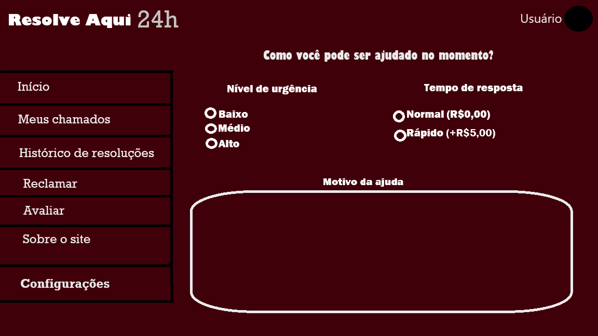
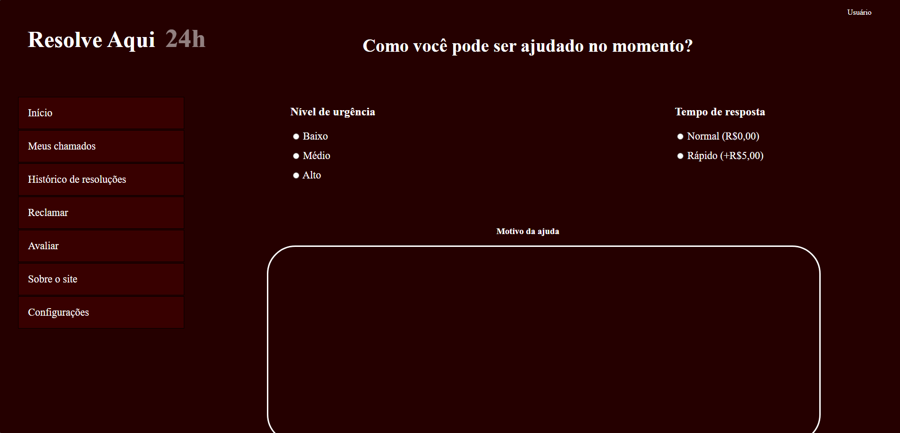

Nome: LUCCA MARINHO ETEROVIK TAVARES PEREIRA
Matrícula: 913529
Proposta de projeto: Resolve Aqui
Descrição: A proposta consiste no desenvolvimento de uma plataforma digital chamada ResolveAqui, que conecta pessoas com problemas do dia a dia a especialistas capazes de oferecer soluções rápidas e personalizadas. O sistema permite que o usuário descreva sua dificuldade e receba suporte sob demanda, reduzindo o tempo e a ineficiência de buscas genéricas na internet. O projeto tem como objetivo facilitar o acesso a conhecimento prático, promovendo agilidade, praticidade e conexão entre quem precisa de ajuda e quem sabe resolver.
------------------------------------------------------------------------------------------------------------------------------------------

------------------------------------------------------------------------------------------------------------------------------------------
